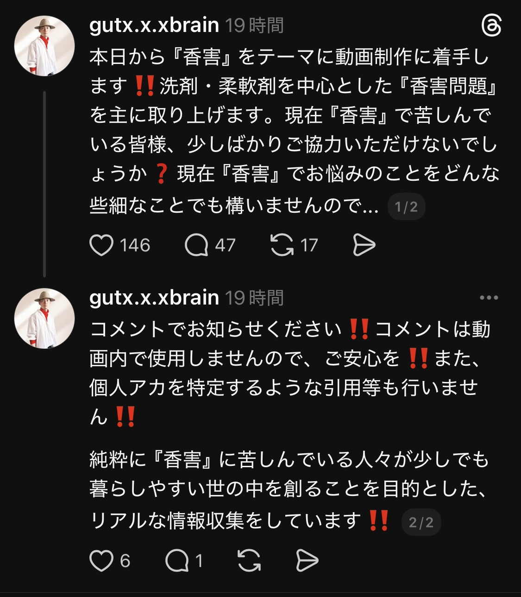

原稿内で「私の考え方」というフレーズを意図的にとりいれている。
その理由は、最悪、法的リスクに触れないように、あくまで自分の考え方を論じている、というスタイルを貫くためのものである。決して自己主張を強めたいわけではない。

承認欲求を満たすだけのコンテンツにはしない。
世界中で苦しんでいる人々の健康を考えて発信する。
あとで、法的措置で動画を削除する羽目になるのが一番後悔する。

P = Problem（問題）

悩みの代弁（視聴者に共感し、代わりに言語化する）
悩みの言語化（具体例）感情の種類は？

主婦層へのアプローチが強く行き届くように設計する。
なぜなら、洗剤を使う８割は女性だろうから。

---

ここで一気に視聴者の関心を引き付ける演出を加える。

まず、香害だけの文字で１〜２秒。
その後、危機感を煽る演出として緩やかに拡大して２〜３秒。
ここで「香害」というワードを一気に視聴者の脳裏に埋め込む。

「香害」爆大文字で表示　
辛いですよね〜。

人とすれ違っただけで、香りつき柔軟剤の匂いに「くっさ‼️」と感じてしまう
電車待ち半径５メートル付近からケミカル臭を察知してしまう
電車に乗ったら乗ったで、近隣の匂いが強烈で、すぐ席を移動しなければならない
宅配業者が荷物を届けてくれるたびに、柔軟剤の匂いがきつくてガチで苦痛
ウォーキング中に近隣の洗濯物が臭くて、ガチで“香害”だと感じる
人工的な香料がする人の近くにいると、それだけで匂いが移ってしまい非常に困る
匂いは記憶に残りやすいため、不快感が長引き、強いストレスを感じる
人工的な香料を嗅ぐだけで、頭痛や気分の悪さに襲われることがある

まだまだありますが、これが私のリアルな体験です。

実体験（昔の自分もあなたと同じだったことを提示）

きっとこの動画を観ている９割の人が、私と同じ『香害問題』に苦しみ、悩んでいるのではないでしょうか？

私もそのうちの１人でした。
先日、Threadsで何気なく投稿したところ、想像以上の反響がありました。

それだけ香害に悩み続けていた人がいたという証明ですね。

フォロワー数が多いからじゃないの？って思いますよね。
フォロワー数は当時わずか2名。
それでも「コメント」や「いいね」が次々と寄せられ、「これは自分だけの問題じゃない」と強く実感しました。

この結果から、「動画1本で香害問題の根本を分かりやすく伝えたい」と思い、行動に移したのが今回の動画です。

さらに私は、可能な限りリアルな声を集めたいと考え、Threadsでアンケートを実施しました。

投稿時のフォロワー数１２名。
コメント数には、私の返信も含まれるので、この時点で２５名近くの人が賛同してくれた結果になります。
最終的には、４０名の方から、ご協力いただきました。
これは決して私の影響力や濃いファンが理由ではなく、純粋に多くの人が同じ苦しみを抱えていた証明です。

実際に寄せられた内容をシェアしますね。

１人目の◯◯に変更する

子どもと家庭への影響

・子どもが学校から帰ると、服や髪だけでなくプリントや教科書まで柔軟剤臭が染みついている  
・紙類は特に匂いが消えず、毎日続くことで呼吸器系への影響が心配  
・自宅に来る業者（電化製品の修理やリフォームの大工さんなど）からも強烈な匂いが漂い、家具やカーテンに染みつく  
・一度で2週間も残ることがあり、日常生活そのものが脅かされている

健康被害  

・喉や鼻の違和感から始まり、頭痛・めまい・動悸・胸の痛みに苦しんでいる  
・外出を避けても、家族が持ち帰る柔軟剤や洗剤の匂いが家に侵入し防ぎきれない  
・マスクをすると布に成分が付着し、逆に症状が悪化する。皮膚が弱く長時間着用も困難  
・移住も検討したが、新居の建材や近隣住民の行動で再発する恐れがあり、逃げ場がない

生活全般への影響

「スーパーで買う食品、外食、パン屋や和洋菓子、コーヒーチェーン──あらゆる食べ物に移香しており、安心して口にできるものがほとんどありません。外出から帰ればすぐにシャワーを浴び、予備の洗濯機で衣類を洗う生活を余儀なくされています。

飲食業で“香料や移香のないように気をつけている”と伝えても、周囲からは無反応で、世の中の人々が何も感じていないのだと痛感します。

さらに、宅配業者や家電修理業者など、自宅を訪れる人の匂いも非常に辛いです。子どもたちに関しては、友人の服や持ち物の柔軟剤臭が強烈すぎて、やむを得ず“お泊まり禁止”にしていました。本当は泊めてあげたかったのに……それが叶わなかったのは残念でなりません。」

生活全般への影響  

・食品や外食、パン屋、コーヒーチェーンまで移香しており、安心して食べられるものが少ない  
・外出後はすぐにシャワーと洗濯が必須で、生活全体が制約されている  
・外出で移香した衣類は、予備の洗濯機で洗わなければならない
・宅配業者や修理業者が自宅を訪れるときの匂いも非常に辛い、自宅が汚染される  
・子どもには、友人に強烈な柔軟剤臭があるのため“お泊まり禁止”にせざるを得ず、本当は泊めてあげたいのに心が痛む

家庭と周囲の無理解

・子どもが学校から帰ると髪や服に匂いが染みつき、酷い時は鼻血を出すこともある  
・宿題のプリントにも匂いが移り、学習や家庭生活にまで影響している
・間違って持ち帰った衣服を善意で洗濯して頂いたが、柔軟剤臭が強烈で、処分せざるを得なかった。どんなに洗っても完全には取れない。
・香害啓発しても「思想が強い」「宗教じみている」「好みの問題」と片付けられ、理解されない  
・身内に相談しても精神的な問題と誤解され、孤立感に苦しむ  
・街中での曝露を避けるため、猛暑でもマスクを外せず、生活全体が負担になっている

宿泊施設と社会的偏見・環境問題

・ホテルの客室やリネンに柔軟剤成分が残留し、安心して眠れない  
・ファ◯リーズなどの消臭剤が常備され、成分残留でさらに危険が増す  
・ホテル室内を換気できず、部屋全体が汚染されているため、仕方なく床にタオルを敷いて、その上で眠ている
・ネット上では「外に出るな」「窒息しろ」といったヘイト発言を受ける    
・貝から柔軟剤成分が検出されるなど、洗濯排水による環境汚染が現実化している。こんな状況は一刻も早くやめるべき。

高齢者による重度の症状と生活制限  

・夫婦ともに化学物質過敏症を発症、救急搬送されたこともある  
・香りを吸い込むと思考が止まり、手が麻痺して物が持てなくなるなど危険な症状が出た経験がある
・MRIやCTでも異常は見つからず、原因が分からないまま苦しむ
・外出時は布と不織布の二重マスクで防御、家への持ち込みを徹底的に避けている  
・シャンプーも使えず美容室に行けない、宅配業者の柔軟剤の匂いも大きな負担になっている  
・人の集まる場所を避ける必要があり、社会参加が難しく孤立感がある  
・医療機関の看護師、市役所、公共の場で働く人の強い香りにさらされることもあり、強いストレスを感じている
・花粉症と同じく、誰でも将来的に発症し得る可能性があると感じている

日常生活での体調不良

・体調不良は2009年頃から始まり、年々悪化している
・飲食店で香り付きおしぼりを使われると食欲を失い、駅や電車でも目の痛みや涙が止まらなくなる  
・柔軟剤の香りに逃げ場がなく、外出が困難
・香り商品を扱う店では強烈な臭気にさらされ、商業施設で買い物ができない  
・近隣のスーパーでは無香料石けんが手に入らず、要望を出しても叶わない  
・外出すると髪や服に匂いが付着し、髪の泡立ちが悪くなるなど影響が残る

保育士さんから現場の声を頂戴しました  

・子どもの着替えや布団に入れてトントンする際、柔軟剤などの匂いが手に強く残り取れない  
・午睡中、布団や毛布から香りが立ち上がり、部屋全体が充満して頭痛や吐き気を感じることがある  
・子ども同士で匂いの強い衣類が混ざり、敏感な子が咳き込んだり体調を崩すケースがある  
・工作や給食の時間にも、衣服からの移香が気になり集中できない子が出てくる  
・保育士自身も、保護者が洗った衣類や持ち物に強い香りが残っていて、長時間対応するうちに体調不良になることがある

これがリアルな声であり、この他にも多数頂戴しているのが現状です。

現在、この問題は社会問題となっており、注目を集めています。

本題に入る前に、私の考えを正直にお伝えます。

今回の主題である「香害問題」は、我々消費者に問題があると私は考えていません。
動画を観ている中には「私は気にならない」と思う人もいるでしょう。  
でも、あなたに無理な変化を求めるために、この動画を作ったわけではありません。

宅配業者や作業員を責めるつもりもありません。  
彼らの背後には、その作業着を毎日洗っている“主婦”がいます。

主婦の方々は、何を基準に洗剤、柔軟剤を選ぶのか？ 
「汚れが落ちる」「効率がいい」「家族が気持ちよく過ごせる」。  
その思いやりが出発点であると、私は考えました。

一方で、その思いやりが知らぬ間に市場を支え、強香製品を蔓延させ、結果として消費者同士が互いに傷つけ合う構造を作り出しているのです。

大げさに聞こえるかもしれません。
でも当事者にとって「香害」をはじめとした「化学物質過敏症」は、一歩間違えば命を落とすことすらあり得る現実なのです。

だからといって、この香害問題は、消費者同士で争ったとて、何の意味もない。
これが私の考え方です。

私たちが向き合うべきは、その背後にある「構造」です。

実は、この香害問題の根幹にあるのは「経済活動への依存」です。
香りを売れば利益になる。その仕組みが、この問題を拡大させてきました。

歴史を振り返れば、輸入柔軟剤「Downy（ダウニー）」の登場が、日本の企業に危機感を与え、人工的な香料競争を一気に加速させた。  
これが、今の香害問題を生んだ出発点だと私は考えています。

---

ダウニーが持ち込んだ「強い香り文化」

1990年代後半から2000年代初頭にかけて、日本にも米国製の柔軟剤「Downy（ダウニー）」が輸入され、特にエイプリルフレッシュといった甘く濃厚な香りが「本場アメリカの香り」として輸入雑貨店や通販で人気を博しました。

当時の日本の洗剤、柔軟剤といえば「無香料〜微香性」が当たり前で、香りといっても“洗い立ての清潔感”程度が常識。

それがダウニーによって一変しました。濃厚でねっとりとした香りが「おしゃれ」「セレブ感」「アメリカらしい生活」としてマーケティングされ、若年層や主婦層を中心に一気に広まっていったのです。

この輸入文化が引き金となり、日本メーカーも一斉に追随。「香りが1週間続く」「部屋干ししても良い香り」といった訴求を次々と打ち出し、香料の強い製品を投入し始めました。

つまり、ダウニーの登場が契機となって、日本市場全体に“香り競争”が加速したのです。

日本市場での構造変化

日本の国内大手は、当初「日本人は強い香りを嫌う」として控えめな製品を出していましたが、ダウニー人気を受けて方向転換します。

「香りが1週間続く」「部屋干ししても良い香り」といった訴求が2000年代中盤以降に急増。結果として、「無香料」の選択肢は縮小し、香料強化型が主流化しました。

消費者は「香りがしなければ洗えていない」という新しい価値観にシフトさせられてしまったのです。

香害問題の特徴

ここで大きな問題があります。  
日本は米国と違い、住宅事情が特殊です。狭い空間、高気密な住宅、そして集合住宅が多い。  
そのため、香料が滞留しやすく、米国以上に濃厚な香りが生活空間にこもりやすい構造なのです。

さらに、日本には「部屋干し文化」があります。乾燥機や広い庭ではなく、狭い部屋の中で洗濯物を干す。その結果、ダウニー的な強香製品を使うと、部屋全体がすぐに充満し、隣家にまで影響を与え、健康被害を訴える人が続出しています。

宅配業者と接触しただけで、頭痛やめまいを起こす人がいる。  
近隣の洗濯物から飛んできた香料が自分の洗濯物に付着する。  
窓に付着した化学物質によってアレルギー反応を起こす。  
こうした被害が年々増加しているのが現状です。

これは私だけの体験ではありません。私のThreadsに寄せられた一つ一つのリアルな声が、この現実を裏づけています。

本来は「香りで清潔を演出する文化」が輸入されただけですが、生活環境の違いが“香害”という形で負の側面を強調するまでに至りました。これは立派な社会問題なのです。

まとめると

ダウニーが起点となり、日本の柔軟剤・洗剤市場における「強香ブーム」に発展。

国内メーカーが焦り、企業が競争軸を「香りの強さ・持続性」にシフトさせ、市場全体を変えてしまった。

その結果、「香り＝清潔」という幻想が常識として刷り込まれ、今や香害問題は社会全体を巻き込む「香料公害」と呼ぶべきレベルにまで拡大している。

これが私の考えです。

---

そしてもう１つ、大きな問題があります。

それは、なぜここまで浸透してしまったのか？という視点です。

なぜ、これほど多くの人々が、不必要に合成された強度の香料を、わざわざ身にまとわなければならなくなってしまったのでしょうか。

そうです。もう１つの大きな問題。それは「マーケティング」です。

先述のとおり、この香害問題の根幹にあるのは「経済活動への依存」である。これが私の考え方です。  
「香り」でお金が儲かってしまうから、香害に発展した。そうした歴史的背景があるのは事実です。

しかし、それだけではありません。そこに「マーケティング」という巨大な要因が加わっているのです。

つまり、企業がお金儲けの一環として、イメージの良い芸能人やインフルエンサーを起用し、巧みなマーケティングで消費者を錯覚させ、購買へと誘導する。この活動そのものが、私が考えるもう１つの大きな問題なのです。

よく考えてみてください。広告に起用されている芸能人、インフルエンサーは、本当にその商品を日常的に使っているのでしょうか？

私は過去に１２年ほど美容師として働いていました。
その在職中、誰もが一度は目にしたことのある某有名CMのヘアメイク現場に携わった経験があります。具体的な広告名は控えますが、演者がその商品を普段から使っているとは到底思えませんでした。

一方で、元プロ野球選手のイチロー選手は、長年ユンケルの広告に起用されてきました。
その理由は単純です。彼が毎日、１日も欠かさずユンケルを飲み続けていたからです。  
引退した現在もなお、飲み続けているのだそうです。

いかにもイチロー選手らしいですよね。
でも、これこそが本来あるべき広告のイメージモデル。そう私は考えます。

しかし、イチロー選手のような「リアルな背景を持つモデル」は全体の１割程度。  
残りの９割は、実際にはその商品を使っていない人たちが演者として登場している。  
これは私自身のリアルな体験と、客観的なリサーチの両方から導き出した考えです。

未だにこのプロモーションスタイルに変化が少ないのが非常に残念ですが、これが業界のリアルな実態です。

私は、美容師歴１２年を経て、その後はフリーランスのデザイナーとして１２年以上活動してきました。さらに、動画クリエイターとしては総フォロワー数６６万人を超え、再生数は合算で４億を突破しています。

だから、マーケティング業界の仕組みはそれなりに理解しているつもりです。  
つまり、なぜ消費者が人体や環境に悪影響を及ぼす合成香料を、今も使い続けてしまうのか。  
この根本的な構造を理解しているのです。

言い換えれば、合成香料の氾濫は、偶然に広まったのではありません。
意図的に設計された経済活動の副産物であり、マーケティングの成果物なのです。

そして、その副産物は、私たち一人ひとりの人体に、平等に影響を及ぼしていきます。

この点を踏まえたうえで、次に──問題の規模と深刻さを、さらに具体的に示していきましょう。

---

A = Amplify（拡大）：問題の拡大（問題の重大さを提示）

実は、この『香害』。臭いだけの問題ではないんです。

香害が現在のまま続いた場合、健康、環境、社会の三つの領域で問題は拡大し、深刻さを増していきます。

【健康（人体への影響）】  

呼吸器系の負荷  

合成香料は、喘息や慢性的な咳、呼吸困難を誘発し、すでに症状を抱えている人をさらに悪化させます。  特に敏感な人、子ども、高齢者は直撃を受けやすく、日常生活の維持すら困難になるケースがあります。

冒頭で紹介したThreadsアンケートに協力してくださったご年配者の声が、まさにこの例にあたります。  

そして、子どもたちへの影響も深刻です。学校に通えなくなった子どもが、実際に増えてきているのです。

ここで、あえて言わせていただきます。  
この動画を視聴しているそこの奥さん‼️  
「学校へ通えなくなった子どもたちが増えてからでは遅いんですよ‼️‼️‼️」  
「明日は我が身」なんです。

日本人女性の団結力は、時に社会を変えるほどの凄まじいパワーを秘めています。  
けれども、その力の使い道を誤れば、事態をさらに深刻化させる可能性も同時に秘めている。

だからこそ、私は強く訴えたいのです。  
どうか、その凄まじいパワーを正しい方向に使っていただけないでしょうか。

想像してみてください。  
「ご自分のお子さんが、学校に通えなくなるほど深刻な状況に陥ったとしたら……」  
あなたは、それでも現在と同じ行動を取り続けますか？

どうか、いま一度。  
この問題を「自分ごと」として真剣に考えてみてください。

もし少しでも共感いただけたのなら、一刻も早く行動に移しましょう。

アレルギー反応・刺激

合成香料によって、皮膚炎、目や喉のかゆみや痛み、さらには頭痛やめまいまで引き起こされます。  
軽度に思える症状であっても、繰り返し曝露されることで慢性化し、やがては通学や就労そのものが困難になるケースも十分に想定されます。

年々アレルギー症状が悪化し、抗生物質に頼りっきりになっている人はいませんか？  
花粉症のシーズンでもないのに、異様にくしゃみや鼻水が止まらない──そういう人は、ぜひ危機感を持っていただきたいのです。

私は現在42歳ですが、幸いにも花粉症の症状はありません。  
「いやいや、それは今だけだろ‼️」  
「花粉症は、ある日突然やってくるんだから‼️」  
そう思いますよね。

そうなんです。まさにその通りなんです。  
合成香料による健康被害も、花粉症と同じように、ある日突然やってくるのです。  
だからこそ、今から防衛対策をしておかないと、取り返しのつかない症状へと発展してしまう可能性があります。

そして、影響を受けるのは人間だけではありません。  
ペットにだって、合成香料が蓄積された衣類を着せ続ければ、人間と同じようにアレルギーを発症することは決して珍しくないのです。

化学物質過敏症の拡大

こちらは冒頭で紹介したリアルな声にもありましたが、一度発症してしまうと、ほんのわずかな量の香料に触れただけで、強烈な症状が出るようになります。  
改善が非常に難しいため、被害は長期にわたり続きます。

そして患者数は、確実に増加していくと予測されています。  
これは一部の人だけの特別な問題ではありません。誰にでも、明日、突然、降りかかってくる可能性がある現実なのです。

【環境への影響】  

大気汚染の助長  
　人工香料から発生する揮発性有機化合物が光化学スモッグやPM2.5の生成を後押しします。都市部では呼吸器疾患の患者をさらに増やす要因となります。

水系・生態系への汚染  
　合成ムスクやフタル酸エステル類は分解されにくく、河川や海に流れ込みます。水生生物に蓄積し、やがて食物連鎖を通じて人間の体内にも入り込む危険があります。

不可逆的な拡散  
　一度環境に放出された化学物質は回収できず、将来的に規制を強化しても「すでに汚染された地球」を抱え続けることになります。

【社会的影響】

教育への影響

学校での香料使用──柔軟剤、整髪料、香水など──が原因で、教室に居続けられない児童・生徒が出ています。  
結果として、不登校や学習機会の喪失につながっている。これはリアルな声の中でもトップ級に多かった事例です。

「うちの子どもは大丈夫だから」  
──そうやって呑気に考えている方はいませんか？

たった今この瞬間は、大丈夫かもしれません。  
しかし、明日、１週間後、１か月後、３か月後──。  
本当に「自分の子どもは大丈夫だ」と言い切れる保証は、どこにもありません。

そして忘れないでください。お子さんが苦しむようになれば、その痛みは必ず、親であるあなた自身に返ってきます。

わが子が学校に行けず、日常を奪われ、苦しむ姿を目の当たりにすれば、あなたもまた同じように心をえぐられるはずです。

どうか今一度、真剣にお考えください。  
そして、ご協力いただける方には、心から感謝申し上げます。

労働環境の悪化

オフィスや工場などの職場で香料が充満すると、集中力の低下や体調不良を招き、勤務そのものが困難になる人が増えていきます。  
結果として、働き続けられず離職に追い込まれるケースも想定され、雇用そのものの不安定化を招くのです。

ここで強く申し上げます。  
私は主婦の方を悪者にしたいわけではありません。  
しかしながら、実際に「洗濯の選択」を担っている９割は主婦であり、女性である。  
だからこそ、この場を借りて、はっきりと言わせていただきます。

最悪の場合、旦那さんが働けなくなったら、今の家計を維持していくことは不可能になります。  
その可能性を秘めていることを、今一度、真剣に考えていただきたい。

「たかが洗濯」「たかが柔軟剤」──そう思うかもしれません。  
けれども、その１つの選択を毎日積み重ねていくことで、膨大な影響力が社会に及んでしまうのです。

どうか、人ごとではなく「自分ごと」として考えてください。  
ご協力いただける方には、強く、深く、感謝申し上げます。

公共空間での摩擦

電車、バス、映画館といった閉鎖空間に、強い香りを持ち込むことでどうなるか。  
周囲に不快感や健康被害を与え、トラブルや差別、排除の火種となります。  
「香りをめぐる社会的対立」──その顕在化は、もはや時間の問題です。

弱者の孤立

化学物質過敏症や香害による体調不良を訴える人たちが、いまだに「神経質だ」と片付けられています。  
その結果、周囲から理解されず、孤立を余儀なくされている。

社会参加の制限は強まり、やがては障害に近い状況を生み出してしまう。  
これが、香害の社会的影響の現実なのです。

S = Solution（解決策）：具体的な解決策を提示する

合成香料による香害を減らすには、まずは「個人ができる範囲の取り組み」から始めることが何よりも大切です。

ひとつ目は、合成香料が配合された洗剤や柔軟剤の使用を控えることです。  
消費者の行動が変われば、メーカーも製品戦略を変えざるを得ません。  
「香料を使わなくても清潔は保てる」──この意識を一人ひとりが広げていくこと。これが第一歩です。

歴史を振り返れば、輸入洗剤「Downy（ダウニー）」の存在が、日本企業の危機感を煽り、ここまで人工的な香料を強めたきっかけであることは先述しました。  
であれば今度は、その真逆の行動を私たちが起こすべきです。

つまり、企業側のイメージ戦略マーケティングに順応していくのではなく、消費者一人ひとりが「自ら」安全と健康を守り続けるために行動する。  
その積み重ねが、人間・社会・そして地球が心から喜ぶスタイルを維持する力になる。私はそう考えています。

次に、代替手段をうまく使うことです。  
「無添加の石けん」や「セスキ炭酸ソーダ」、酸素系漂白剤を組み合わせれば、衣類の臭いや汚れの問題は十分に解消できます。  
これは昔から続く生活の知恵でもあり、実際に使ってみれば「香料なしでも全く困らない」という実感につながります。

具体的な使用方法については、このあと詳しく紹介しますので、ぜひ最後までご覧ください。

私自身、長年、自分の加齢臭に悩んできました。  
しかし、セスキ炭酸ソーダを投入して洗浄したところ、見事に解消されたのです。

これが私のリアルな体験です。

そして、発信の仕方も非常に重要です。  
SNSなどで「合成香料を使っている人」をただ避難するのではなく、人体や生活環境に悪影響を及ぼす可能性があることを冷静に伝える。  
対立を煽るのではなく、「一緒に考えよう」という姿勢で共有する方が、確実に広がりやすくなります。

もちろん、コストの問題を気にする方もいるでしょう。  
確かに無添加や自然派の製品は割高に見えます。

ただし、需要が高まれば企業も仕入れ量を増やせるため、供給が安定し、価格は下がっていく可能性が十分にあります。  
要は、選ぶ人が増えればコストは下がる方向に動いていくということです。

一方で、原料を輸入に頼っている場合は、資源獲得コストが高値になる懸念もあります。  
だからこそ、国内で調達できる資源の活用や流通の効率化を進める必要があるのです。

---

T = Testimony（証拠）：変革と証明（実績をもとに信憑性を高める：権威性）

これは、私一人の問題ではありません。  
すでに多くの人が、同じように苦しんでいます。

・子どもが学校から帰ると、服や髪だけでなく、プリントや教科書まで柔軟剤臭でいっぱいになる。  
・宅配業者が来るたびに、強烈なニオイが気になり、生活そのものが辛くなる。  
・柔軟剤の匂いを吸った瞬間に意識を失い、救急搬送された高齢者までいる。

こうした証言が、フォロワー数わずか12人で投稿した時点で、次々と集まってきたのです。  
つまり──“香害”は、決して一部の人の気のせいではありません。  
すでに社会全体が直面している、れっきとした現実の問題なのです。

ThreadsやXで「香害」と検索してみてください。  
同じように苦しみ、そして試行錯誤の末に工夫を重ね、解決にたどり着いた人たちの声が、山のように確認できます。

その一つひとつの声の積み重ねが示しているのは──香害は、個人的な小さな悩みにとどまるものではない、ということ。  
社会全体で共有し、向き合うべき大きな問題である、ということです。

どうか、この現実を直視してください。  
そして、ぜひ参照して、自分の生活と重ね合わせて考えていただきたいのです。

---

それでは本編に入りましょう。

1.香害は立派な健康被害である

ここで、香害のリスクについて再確認しておきましょう。

Assertion（衝撃の結論）
香害は「匂いが好きか嫌いか」という単なる感覚の問題ではありません。実際には、体をむしばむ健康被害であり、私たちの生活を根本から脅かす存在です。

理由（共通の敵を批判する）
市販されている合成香料入りの洗剤や柔軟剤は、「香りで清潔感を演出できる」と錯覚するような宣伝が行われています。しかしその実態は、揮発性の化学物質を空気中にばらまき、本人だけでなく周囲の人まで巻き込みます。その結果、頭痛、吐き気、喘息の悪化といった症状が引き起こされているのです。つまり「いい香り」を売りにした商品こそが、健康を侵す原因となっています。

具体例（気づきを与える）
満員電車で隣に立っている人から柔軟剤の強い匂いが漂ってきたとします。その瞬間に「頭痛」や「めまい」を訴える人がいます。学校でも同じで、香料が染みついた制服の匂いで教室に居られなくなる子どもがいるのです。このような匂いが原因で、登校拒否せざるを得ない子どもがいるのも事実です。これは単なる不快感ではなく、体が拒絶反応を示す「健康被害」そのものです。

再度結論
香害は一部の人が大げさに言っているのではなく、誰にでも起こり得る深刻な健康問題です。今日なんともなくても、明日の朝には発症しているかもしれません。これを「ただの匂い」と軽視すれば、被害は拡大し、社会全体が取り返しのつかない状況に進んでいきます。

無香料＝洗えていないという誤解（小見出しテロップ）

そして、「無香料＝洗えていない」、これは大きな間違いです‼️

Assertion（衝撃の結論）
「無香料＝汚れが落ちていない」という考えは根拠のない誤解です。香りの有無は清潔さを示すものではありません。

理由（共通の敵を批判する）
合成香料入り洗剤の広告は「いい香り＝清潔」「匂いが続く＝衛生的」と刷り込んできました。しかし、実際に汚れを落とすのは香料ではなく洗浄成分です。香りはあくまで“ごまかし”であり、清潔さの証明にはなりません。ただの販売戦略の１種です。

具体例（気づきを与える）
例えば、香水を大量につけて汗をかいた人を想像してください。強い香りで体臭をごまかすことはできますが、体自体が清潔かどうかは別問題です。衣類でも同じで、合成香料でごまかしても菌や皮脂汚れが残っていれば、不衛生な状態に変わりありません。

再度結論
よって、「香り＝清潔」という思い込みは、メーカーが作り上げた幻想です。無香料でも汚れはしっかり落ちますし、むしろ余計な化学物質を持ち込まない分だけ安全で本質的に清潔なのです。

無添加で洗濯は成立する

ここまでで、香害が健康をむしばむ深刻な問題であること、そして「無香料＝洗えていない」という誤解が根拠のない思い込みであることを確認しました。では次に、本編の核心である「無添加でも十分に洗える理由」を解説します。

私の実体験

私自身、これまでに様々な洗剤を試してきました。輸入製品「ECOVER（エコベール）」は、加齢臭の分解もある程度でき、気に入っていたのですが、価格の高騰と輸入頻度の低さから使い続けるのが難しくなりました。その後、国内製品を探し、ファーファの「香りのない洗剤」や無印良品の衣類用洗剤なども試してきました。しかし今では、Threadsで話題となっている「シャボン玉石けん スノール」を使用しています。

スノールは、無添加でシンプルかつ実用的であるだけでなく、香害のリスクが完全に排除されているという点で他製品と大きく異なります。無香料であるにもかかわらず、石けん由来の確かな洗浄力を備えており、日常の洗濯には十分に対応できます。香りでごまかすのではなく、汚れを根本から落とすことに重点が置かれているため、本当の意味での清潔さを実感できるのです。コストや入手のしやすさもバランスが取れており、無添加洗剤の中で現実的かつ安心できる選択肢だと考えています。

2.基本の4本柱

無香料で洗濯を成立させるための基盤は、次の4つです。これらを組み合わせれば、合成洗剤や柔軟剤を使わなくても、衣類を清潔に保つことができます。

Assertion（衝撃の結論）
「スノール」「セスキ炭酸ソーダ」「酸素系漂白剤」「クエン酸」。この4本柱を使えば、合成洗剤や柔軟剤を使わなくても日常の洗濯は完全にカバーできます。

理由（共通の敵の批判）
合成洗剤は「長続きする香り」「最新の技術」を強調しますが、実際は健康被害の原因となる成分を多く含んでいます。一方、ここで挙げる4つはシンプルで、汚れを落とすための本質的な役割だけを果たします。

具体例（気づきを与える）
1. 石けん洗剤（例：シャボン玉スノール）

石けん由来の洗浄力で、皮脂や食べ物の汚れを確実に落とします。仕上がりは柔らかく、肌に優しいのが特徴です。
代表的な製品には「シャボン玉スノール（液体／粉末）」「パックス洗濯用石けん液」「ミヨシ 無添加お肌のための洗濯用液体せっけん」などがあります。

2. セスキ炭酸ソーダ

油汚れや酸性の臭いを中和する強力なアルカリ洗浄剤です。普段使いではコストも安く、経済的に続けられます。
「アルカリウォッシュ」「セスキの激落ちくん」など、市販で入手可能です。

3. 酸素系漂白剤

「黄ばみ」や「黒ずみ」、「たんぱく質を含む汚れ」に強いのが特徴です。  
基本的にはぬるま湯（40〜50度）に溶かしてつけ置きすることで高い効果を発揮します。

ただし、血液汚れに関しては少し注意が必要です。  
詳しくはこのあとご紹介する「血液汚れの落とし方」で解説しますので、ぜひ引き続きご覧ください。

日常的に使えば衣類を清潔に保つことができ、色柄物にも使えるため幅広い用途に対応可能です。

4. クエン酸

仕上げに使うことで柔軟剤代わりになります。水道水に含まれるミネラルを中和し、繊維を柔らかく整える効果があります。タオルなどは柔らかく仕上がり、ゴワつきを防ぐことができます。
そのほかには、一回につき粉末小さじ１杯ほどで「せっけんカス」や「雑菌」も防げます。

再結論（強調）
つまり、スノールを基軸に据え、セスキで臭いを断ち、酸素系漂白剤で頑固な汚れを分解し、クエン酸で仕上げる。この4つを組み合わせるだけで、香料に依存せずに真の清潔を得ることができるのです。

入手性と注意点

「石けん洗剤」や「セスキ炭酸ソーダ」は、自然食品店、ドラッグストア、ホームセンター、スーパーでも販売されています。  
さらにインターネット通販を利用すれば、より多くの選択肢を見つけることができます。

ただし、コストパフォーマンスを考えるなら、店頭での購入がベストかもしれません。  
ここは実際に実践されている奥様‼️  
ぜひコメント欄で「どこで買っているか」「どのくらいお得か」を共有していただけると、本当に助かります。

次に注意点です。  
「消臭」と表示されている製品の多くには、実は香料が含まれている場合があります。これは「無香料」とは全く異なります。

さらに、「香料不使用」と書かれていたとしても油断できません。  
合成香料やマイクロカプセルが実際には使われているケースもあるため、パッケージの表示だけを鵜呑みにせず、その裏側にまでしっかり目を向けることが大切です。

すすぎ2回の重要性

洗浄力だけでは「本当の清潔さ」は得られません。
大切なのは「すすぎ」を2回行うことです。

香料や洗剤成分が衣類に残留すると、時間の経過とともに酸化・分解し、不快なニオイが“蓄積臭”となって現れます。
これはただの不快感にとどまらず、健康リスクや周囲への悪臭拡散にもつながります。

特に、過去に強度の香料付き合成洗剤や柔軟剤を使ってきた衣類は要注意です。
繊維の奥深くにまで成分が残っているため、一度や二度の洗浄では、その蓄積された成分を完全に落とし切ることは非常に難しい、というのが私自身のリアルな実体験です。

こうした場合は、一回一回の洗濯ごとに「無香料石けん洗剤」と「セスキ炭酸ソーダ」を併用し、しっかり洗浄すること。
そして同じくらい重要なのが、「水ですすぎきる」という工程です。

洗うことと同じくらい、“流し切ること”が清潔さを決定づける。
これを意識できるかどうかが、香害を遠ざける大きな分かれ道になるのです。

蓄積臭への注意喚起

衣類の蓄積臭

過去に使用してきた合成洗剤や柔軟剤による香料・合成成分は、繊維に付着して残りやすく、これが原因で「洗ったのに臭う」状態を引き起こします。

この理解がない人が「無香料の石けん洗剤」や「セスキ炭酸ソーダ」に変更しても、効果を実感できず、もとの香害洗剤に戻るケースも多々見受けられました。

しつこいようですが、これはご自身やご家族の健康被害から守る大切な「知恵」です。化学物質過敏症（CS）は、誰にでも平等に発症する可能性があります。
決して「自分には関係ない」と思わず、どうか気をつけてください。

洗濯槽の蓄積臭

同様に、長年使ってきた洗濯槽内部にも合成成分や香料カプセルがこびりつき、カビや雑菌の温床になります。そのため、無香料の洗剤に切り替える際には、酸素系漂白剤を使った洗濯槽クリーニングを一度、もしくは数回、行うのが効果的です。

また、なかには洗濯槽を洗浄するタイプにも香料が含まれているものがあります。私も以前、一度だけ知らずに使用してましたが、ほんとうにニオイが取れません。こちらも合わせて気をつけてください。

---

「消臭」vs「無香料」―ここを取り違えると失敗します

結論（Assertion）

「無香料」と「消臭」はまったく別物です。
無香料は“香りをつけない”という意味ですが、消臭は“匂いを打ち消す”処理であり、多くの場合は別の香りでごまかすために香料やマイクロカプセルが使われています。

理由（分かりやすい批判）

量販店で「消臭」をうたう洗剤・柔軟剤の多くは、香料や香料カプセルで“別の匂い”を被せています。結果として、衣類や室内に成分が残留し、後日“蓄積臭”や体調不良の引き金になります。これが香害を長引かせる主要因のひとつです。

編集時では、以下を配列する
![[スクリーンショット 2025-09-18 13.00.01.png]]

※無香料でも、合成界面活性剤やカプセルが入る製品は存在します。アレルギー反応のある方はもちろん、そうでない方も必ず成分表を確認することが必要です。

再結論

香害回避が目的なら、「無香料」かつ「残留しにくい設計である（石けん系・カプセル不使用）」を選びましょう。「消臭＝安全」は誤りです。

「無添加」の定義とは？

メーカーが「無添加」と書く場合、多くは以下のいずれか、または複数を指します。

![[スクリーンショット 2025-09-18 13.04.13.png]]
表示例	実際に除外されている可能性があるもの
香料無添加	合成香料や天然香料を入れていない
着色料無添加	合成着色料を使っていない
防腐剤無添加	パラベンなどの保存料を使っていない
合成界面活性剤不使用	石けん以外の合成界面活性剤を加えていない

「無添加石けん洗剤」と書かれていても、香料だけを除外したものもあれば、石けん成分100％のものもあります。  

法規制のポイント

日本の薬機法や家庭用品品質表示法には、「無添加」という言葉の明確な定義はありません。
そのため「何を添加していないか」は、必ずラベルや成分表示で確認する必要があります。
消費者庁も過去に「無添加表示」に関して注意喚起しており、誤認を与える表示は禁止されています。

シビアな結論

「無添加＝安心・安全」とは限りません。

実際には「香料無添加」だけでも「無添加」と名乗れるため、香料が苦手な人にとっては意味があっても、香害回避としては不十分なケースがあります。

香害対策のほか、化学物質過敏症でお悩みの人は、「石けん成分以外は含まない」タイプを選ぶのが最も確実です。

---

3.ケース別の洗い分け（実用編）

ここからは、実際の生活で直面する“汚れ別”の洗い分け方法を紹介します。  
汗や皮脂、泥や砂、黄ばみ、血液汚れ──。  
どれも日々、洗濯をしている人が直面している現実の課題です。

市販の強香洗剤や柔軟剤で“ごまかす”のではなく、汚れの正体に応じて最適な処理をする。  
これこそが、香害を遠ざけながら本当の清潔を守るための「実践の知恵」です。

汗・皮脂臭

Assertion（衝撃の結論）  
汗や皮脂の臭いは、普通に洗濯しても落ちにくく、時間が経つほど繊維にこびりついて残ります。放置すると、何度洗っても取れない“蓄積臭”に変わります。

根拠がある理由（理解しやすい例で問いかける：共通の敵の批判）  
「洗ったはずの服から、まだ汗臭がする」──誰もが経験するこの現象は、洗濯用洗剤だけでは皮脂の酸性汚れを中和できないからです。汗や皮脂は酸性であり、アルカリであるセスキ炭酸ソーダで中和しない限り、臭いの原因物質が残留します。市販の強香柔軟剤で“ごまかす”やり方は、一時的に臭いを覆い隠すだけで根本解決にはなりません。

具体例（気づきを与える）  
一日着たワイシャツ、運動後の汗をかいたユニフォーム、汗をかいて働き終えた作業着を思い出してください。乾いたあとにツンとした酸っぱい臭いが残ることがあります。これは「汗と皮脂の酸化臭」です。30分ほどセスキ炭酸ソーダに浸け置きし、その後スノールなど石けん系洗剤で洗えば、臭いのもとを中和・分解できます。毎日の習慣にすれば、洗った直後の“戻り臭”を防ぐことが可能です。

再度結論の繰り返し  
汗や皮脂の臭いは「酸性の汚れ」であり、洗剤だけでは落としきれません。
だからこそ、セスキで中和してから洗う。このひと手間を加えることで、臭い残りのない衣類を維持できます。

泥汚れ

運動会で子どもが転んで体操服が泥だらけ。  
サッカー部でスライディングして、ユニフォームの膝から太ももまで泥がべったり。  
あるいは、雨上がりの通学路で子どものズボンが真っ黒になった。  
そんなとき、慌てて水道でゴシゴシしたら……逆に黒ずみが残ってしまった。  
こういう経験、ありませんか？

Assertion（衝撃の結論）
泥汚れは水だけで落とそうとすると逆効果です。繊維の奥に泥が入り込み、黒ずみとなって残ります。

根拠がある理由（理解しやすい例で問いかける：共通の敵の批判）  
泥は「砂＋汗・皮脂・雑菌」が混ざったベタつく汚れ。  
水でこすると、粒子が繊維に押し込まれ落ちにくくなります。  
同じ泥でも、乾いた砂のザラザラ感と、湿った泥の「ねっとり感」はまるで違うのです。

具体例（実践方法）  

まず天日干しして泥を乾かす。  
乾いた泥をブラシでしっかり払い落とす。  
そのうえでセスキ炭酸ソーダ水に浸け置きし、繊維の奥に入り込んだ成分を緩める。  
最後に石けん系洗剤で本洗いする。

テロップ
泥を天日干しして乾かす
乾いた泥をブラシで払い落とす
セスキ炭酸ソーダ水に浸け置きする
石けん系洗剤で本洗いする

再度結論
泥汚れは「乾かして払う」→「アルカリで緩める」→「石けんで洗う」。
この段階を踏んで初めて落ちます。

酸素系漂白剤を使う場合

「漂白剤なら一発で落ちるでしょ？」と、部活帰りのサッカー着を酸素系漂白剤に漬けたら……逆にシミが残った。これもよくある失敗例です。

Assertion（衝撃の結論）
泥汚れは最初から酸素系漂白剤に漬けると「落ちやすくなる場合」もありますが、処理を間違えるとシミが残ります。

根拠がある理由（理解しやすい例で問いかける：共通の敵の批判）  
酸素系漂白剤は「泥そのもの」には効きません。
だからこそ“順序”を間違えると、必ず黒ずみが残ります。  

酸素系漂白剤が得意なのは汗や皮脂などの有機汚れ。泥は砂や鉱物＝無機汚れなので直接は効きにくいのです。ただし「泥＋皮脂・雑菌」という複合汚れには効果を発揮します。

具体例（実践法）

テロップ用
天日干しして泥を乾かす
乾いた泥をブラシで払い落とす
セスキ炭酸ソーダ水に浸け置きしてアルカリで緩める

これまでの手順のとおり、「セスキ炭酸ソーダ水」の浸け置きが完了したら、
次に、40〜50℃のぬるま湯に酸素系漂白剤を溶かし、30分前後つけ置きする。

酸素系漂白剤は、有機成分を分解・浮かせるのに効果的ですが、長時間放置すると逆効果になりかねません。衣類の洗濯表示を必ず確認し、ウールやシルク、金属付属のある衣類には使わないよう注意してください。塩素系漂白剤と混ぜるのも厳禁です。

最後に石けん系洗剤で本洗いし、しっかりすすぐ。ここでようやく繊維に残っていた汚れを洗い流すことができます。

再度結論
酸素系漂白剤は「泥」そのものではなく、「泥＋皮脂」の複合汚れに効果的です。  
必ず「物理的に泥を払う」→「アルカリ」→「酸素系」→「石けん」の順で処理しないと、黒ずみやシミが必ず残って後悔することになります。

砂汚れ

公園の砂場で遊んだあと、ポケットの中まで砂がぎっしり。  
サッカー部の練習でスライディングしたら、ユニフォームの隙間にジャリジャリ砂が入り込んだ。  
そんなとき、洗濯機にそのまま放り込むとどうなるか……。  
砂が繊維の中に残り、ゴワゴワしたり、洗濯槽まで傷めてしまいます。

Assertion（衝撃の結論）
砂汚れを「そのまま洗う」のは大失敗。必ず繊維を傷つけ、洗濯機の寿命まで縮めます。

根拠がある理由（理解しやすい例で問いかける：共通の敵の批判）  
砂は無機物で、水や洗剤では溶けません。粒子が硬いため、繊維の中に入り込むとゴシゴシ洗っても取れにくく、逆に繊維を削り取り、服そのものを傷め続けます。泥と違って皮脂や汗と結びついてベタつくことはないけれど、「物理的な異物」として残りやすいのが特徴です。

具体例（実践法）
テロップ
洗う前に服を裏返してパンパン叩き、砂をできるだけ落とす
ポケットや縫い目に詰まった砂は掃除機で吸い取る
それでも残る場合は流水でざっと流す
その後に洗濯機で通常洗いを行う

まず服を裏返してパンパン叩き、できるだけ砂を落とす。  
次に、ポケットや縫い目に詰まった砂は掃除機で吸い取る。  
それでも残る場合は流水でざっと流す。  
そして最後に洗濯機で通常洗いを行う。

再度結論
砂汚れは「洗剤で落とす汚れ」ではなく「物理的に落とす汚れ」です。  
必ず洗う前に砂を払い落とすこと。これを怠れば、服をボロボロにし、洗濯機まで壊す原因になります。

黄ばみ・黒ずみ

Assertion（衝撃の結論）  
白いシャツの黄ばみや黒ずみは、通常の洗濯では落ちません。一度こびりつけば二度と戻りません。

根拠がある理由（理解しやすい例で問いかける：共通の敵の批判）  
「何度洗っても襟や脇の黄ばみが取れない」──その原因は皮脂やたんぱく質の酸化です。市販の合成洗剤や柔軟剤で“香りでごまかそう”としても、残留物が重なって黒ずみを悪化させるだけです。

具体例（実践法）  
酸素系漂白剤を40〜50℃のぬるま湯に完全に溶かし、衣類を30分〜1時間つけ置きします。長時間放置しすぎると生地を傷めるため注意してください。その後、スノールのような石けん系洗剤で洗えば、酸化した皮脂や「たんぱく質」を分解・除去できます。

さらにセスキ炭酸ソーダを補助的に加えれば、皮脂の中和や再付着防止だけでなく、黄ばみの進行そのものを抑える効果も期待できます。定期的に実践すれば、襟や脇の黄ばみ・黒ずみを防ぎ、衣類の清潔感を長く維持できます。

再度結論の繰り返し  
黄ばみ・黒ずみは「自然には消えない酸化汚れ」です。漂白＋石けん洗い、この二段階を習慣化しなければ、黄ばみ・黒ずみは確実に積み重なっていきます。

加齢臭対策（実体験）

Assertion（衝撃の結論）  
加齢臭は通常の洗濯だけでは落ちにくく、放置すると衣類にこびりついて残り続けます。市販の強香柔軟剤でごまかそうとすればするほど、かえって臭いは衣類に蓄積していきます。

根拠がある理由（理解しやすい例で問いかける：共通の敵の批判）  

「洗濯したのに夫のシャツや自分のワイシャツから独特の臭いがする」──これは誰もが経験しやすい現象です。原因は皮脂が酸化して生じる特有の成分、加齢臭の原因物質とされる「2-ノネナール（に、ノネナール）」などであり、一般的な洗剤では分解が難しいため臭いが残ります。香りで上書きするだけでは、かえって臭いが混ざり、不快さを増すだけです。

具体例（実践法）  
私自身が実践して効果を感じている方法はこちら。  
・洗濯の際にスノール液体石けんを使用し、さらにセスキ炭酸ソーダを大さじ一杯、洗濯槽に入れた衣類の上へ直接振りかける。これだけでも臭いはかなり軽減されます。  
・それでもしつこい臭いが残る場合は、セスキ炭酸ソーダを水500mlに小さじ1杯溶かしてスプレーを作り、衣類に吹きかけて15分ほど放置。その後に通常通り洗濯機で洗浄すると、臭いが驚くほど取れます。  
・このセスキスプレーは、台所や水回りの清掃にも兼用できるため無駄がありません。

再度結論の繰り返し  
加齢臭は「皮脂の酸化臭」であり、一般の洗剤では落ちにくい汚れです。セスキ炭酸ソーダを日常的に取り入れ、石けん系洗剤と組み合わせることで、臭いを根本から断ち、衣類に本当の清潔を取り戻せます。

おしゃれ着（ウール・シルクなど）

Assertion（衝撃の結論）  
ウールやシルクといったおしゃれ着を通常の洗濯洗剤や強い水流で洗うと、生地を傷め、縮みや型崩れ、ツヤの喪失を招きます。一度ダメージを受けた繊維は二度と元には戻らないのです。

根拠がある理由（理解しやすい例で問いかける：共通の敵の批判）  

「お気に入りのセーターを洗ったら縮んでしまった」──誰もが一度は経験する失敗です。これはウールやシルクが動物性繊維で、熱や摩擦に弱く、アルカリ性の洗剤にも耐えられず、すぐに繊維が劣化してしまうからです。市販の合成洗剤や柔軟剤を何も考えずに使えば、繊維が硬化し、着心地や風合いが台無しになります。

具体例（実践法）  

おしゃれ着は必ず中性洗剤を使用します。  
洗うときは30℃以下の水を使い、必ず水温計で確認するか“温かいと感じない程度”を目安にしてください。手でやさしく押し洗いをするか、「ドライコース」「手洗いコース」など弱水流のモードを選びます。  
脱水は短時間にとどめ、バスタオルで衣類を挟み込むようにして水分を吸い取り、平干しにすることで型崩れや伸びを防げます。  
ウールやシルクは直射日光に当てると黄ばみや繊維の劣化を早めるため、必ず風通しのよい日陰で乾かすのが鉄則です。

おしゃれ着は必ず中性洗剤を使用します。  
洗うときは30℃以下の水を使い、手でやさしく押し洗いをするか、「ドライコース」「手洗いコース」など、「やさしい洗い方ができるモード」を選びます。  
脱水は短時間にとどめ、タオルで水分を吸い取って平干しにすることで、型崩れや伸びを防げます。  
ウールやシルクは直射日光を避け、風通しのよい日陰で乾かすのが鉄則です。

再度結論の繰り返し  
ウールやシルクといったおしゃれ着は、「通常の洗濯」と同じ扱いでは必ず傷みます。中性洗剤・衣類をやさしく洗うすコース・平干し、この三原則を守ることが、繊細な素材を長持ちさせる唯一の方法なのです。

血液汚れの落とし方

Assertion（衝撃の結論）

血液汚れはぬるま湯では落ちません。
ぬるま湯で洗えば、その瞬間に“落ちないシミ”へと変わってしまいます。

根拠（なぜそうなのか）
血液に多く含まれるタンパク質は、40℃前後で変性して固まる性質を持っています。つまり、ぬるま湯は「血を固めてしまう温度帯」。結果として、繊維の奥に固着して、黄ばみや黒ずみの原因になります。

具体例（実践法）
まず冷水で予洗い：流水の下で叩き出すように洗い、決してこすらない。  
次にセスキ炭酸ソーダ溶液に浸け置き：必ず水500mlに小さじ1を溶かし、15～30分ほど漬ける（ぬるま湯では不可）。  
その後、本洗い：スノールなど石けん系洗剤で通常洗濯する。  
※時間が経った血液汚れは数時間で落ちにくさが格段に増すため、できる限り早く冷水処理するのが鉄則です。

テロップ
冷水で予洗い：流水で叩き出すように洗う。こすらない。
セスキ炭酸ソーダ溶液に浸け置き：水500mlに小さじ1を溶かし、15～30分ほど漬ける。
本洗い：スノールなど石けん系洗剤で通常洗濯。

再度結論
ぬるま湯で血液を洗うと「落ちにくいシミ」に変わってしまいます。血液汚れは冷水＋アルカリ洗浄（セスキ）＋石けん洗剤で処理すること。これがおすすめの方法です。
このほかにも「おすすめの方法あるよ！」っていう主婦の人がいればコメント欄で共有していだだけると大変助かります。

---

視聴者参加の仕掛け（コメント欄で経験や工夫を共有してもらう）

これまで具体的な洗濯方法について解説してきましたが、ここまでの内容を聞いて、あなた自身はどう感じましたか？

ここから先は、「あなたの番です」。

Assertion（衝撃の結論）  
この動画は、一方通行の情報発信で終わらせるものではありません。視聴者自身の経験や工夫を共有してこそ、価値が広がります。

私がこの動画を制作した真の目的は、洗濯方法を伝えるためではありません。  
少しでも香害や化学物質過敏症のリスクを減らし、地球環境と社会全体に広がるストレスを食い止めること。そして、人間を含め、この地球に生きるすべての生命が健康的に過ごせる日々を取り戻すことです。

根拠がある理由（理解しやすい例で問いかける：共通の敵の批判）  
汚れや臭いに悩んで調べても、結局行き着くのはイメージ戦略のために起用された芸能人やインフルエンサーの広告ばかり。本当に役立つ情報を見つけるのが困難な時代です。
これは、私を含め、多くの人が抱える不満です。

本当にいいものは、イメージ戦略では広がりません。
一人ひとりの実体験による「口コミ」でこそ、広がります。

だからこそ、同じ悩みを持つ人たちが集まり、声を重ね合う場に意味があるのです。

具体例（気づきを与える）  
そこで私からお願いがあります。

私が今回紹介した洗濯方法が全てではありません。

「すでに無香料洗濯を実践済みの人がいれば、ぜひコメントで『こうやってる』『この汚れに効いた』、など共有いただけると非常に助かります。

その行動は、財布を落としたと思って交番に行ったら、中身ごと全部届けられてた奇跡と同じくらい、助かります。

そして、あなたの声が、社会を変える力になります。

毎日当たり前のように行っている洗濯作業が、あなたの家族、すれ違う人々、職場の人、保育園や学校の子どもへと繋がり、やがて社会全体、地球全体へと広がっていきます。

再度結論の繰り返し  
視聴者の声が集まれば、この動画はただの解説で終わりません。実際に使える方法や工夫がコメント欄に積み重なり、明日からすぐ誰かが実践できる“生きた知恵”に変わります。  
あなたの体験が、同じ悩みを抱える誰かを救うのです。

---

コストと現実性

Assertion（衝撃の結論）  
市販の強香洗剤は一見コスパが良さそうに見えますが、実際には“割高”な選択肢です。なぜなら、あえて“根本的に汚れが落ちにくい設計”にして、消費者に使わせ続ける仕組みだからです。

根拠がある理由（理解しやすい例で問いかける：共通の敵の批判）  
「大容量パックで安く買ったはずなのに、すぐになくなる」──そんな経験はありませんか。合成洗剤は泡立ち成分や香料を多く含み、見せかけの爽快感を演出するだけで、肝心の汚れを落とす力が弱い。そのため使用量が増え、結果としてコストがかさみます。

具体例（実践法）  
一方で、石けん洗剤であるスノールは、1回の洗濯にキャップ半分〜1杯程度で十分洗浄できます。セスキ炭酸ソーダも大さじ1杯で効果を発揮します。見た目の容量は少なくても長持ちしますので、少なくとも強香洗剤よりもコストが増える心配はありません。

再度結論の繰り返し  
強香洗剤は「安く見えて実は割高」であり、しかも根本的な汚れを落としにくい構造になっています。一方で石けんやセスキは「少量で済み、しっかり汚れを落とす」。さらにニオイの分解もできるため、コストと健康、どちらを優先しても石けん系洗剤を選ぶのが現実的な答えであり、賢い選択。これが私の考えです。

需要が増えれば価格は下がる

Assertion（衝撃の結論）  
石けん系洗剤やセスキ炭酸ソーダは、今は一見すると高く見えるかもしれませんが、需要が増えれば必ず価格は下がります。

根拠がある理由（理解しやすい例で問いかける：共通の敵の批判）  
市場に多く流通しているのは合成洗剤です。莫大な広告費を投じ、大手流通が優遇しているからです。需要と供給のバランスで価格は決まります。つまり、まだ石けんやセスキを使う人が少ないから、割高に見えているだけです。思い出してください──オーガニック野菜や再生紙だって、以前は「高い」と言われていましたが、需要が増えるにつれて価格は下がり、手に取りやすくなりました。

具体例（実践法）  
実際にスノールやセスキは、ネット通販や一部スーパーで「まとめ買い」すると単価が安くなります。利用者が増えれば、店舗に置かれる機会も増え、さらに流通コストが下がっていきます。つまり「使う人が増えること」そのものが価格を下げる力になります。

再度結論の繰り返し  
今は合成洗剤に比べて石けんやセスキが割高に感じても、需要が広がれば必ず価格は下がります。安心して使い続ける人が増えるほど、家計にとっても、社会にとっても、より現実的な選択肢になっていくのです。

エモいメッセージ（自分のストーリー・想いを伝える）

これまで紹介してきたように本来、洗濯物の汚れの大半は、「石けん」「石けん洗剤」「セスキ炭酸ソーダ」「酸素系漂白剤」で十分落とせます。それにもかかわらず、なぜ世界中の店舗やオンラインショップに、これほど多くの強香合成洗剤が並んでいるのでしょうか。

世界的に有名な女優ジェシカ・アルバも「家の中で最も危険なのは“香料”だ」と警告しています。大手企業は成分の一部だけを開示していますが、実際には有毒化学物質を“香料”の名の下に隠していると指摘しています。
もしこれが事実だとしたら──私たちは何を信じて暮らしてきたのでしょうか。  
（暗転）

私が本当に伝えたいのは、極めてシンプルで、誰もが気づけるはずの事実です。  
「香りでごまかさなくても、清潔は手に入る」ということ。

石けん、セスキ炭酸ソーダ、酸素系漂白剤、そしてクエン酸。
このたった４つの柱で、毎日の汚れは十分に落ちます。
それは、私自身の経験からも、そして数え切れないほどの声からも裏づけられています。

にもかかわらず、いま私たちの身の回りには「香り＝清潔」と錯覚させる広告や、
企業の利益を優先するマーケティングが溢れています。
その結果として、健康を脅かし、環境を汚し、社会の中で人と人を分断しているのです。

だからこそ、私は声を上げます。
「香害」は決して一部の人のわがままではない。  
明日の朝、あなたの家族や子どもに起こっても不思議ではない──それほど身近で避けられない現実なのです。

今日から、あなたは選べます。  
香りでごまかすのではなく、汚れを落とす本質的な方法を。  
大切な家族の健康を、そして未来の地球を守る選択を。

これは特別な人だけに許された選択ではありません。  
あなたが次に買い物かごへ入れる、そのひとつの選択が、未来を変える力になるのです。

この瞬間から、共に歩み出しましょう。

---

エンディング

最後まで耳を傾けてくださり、心から感謝します。

もしあなたがすでに「無香料・無添加の洗濯」を実践しているなら、ぜひコメント欄でその方法を共有してください。  
その一言が、同じ悩みに苦しむ誰かの“命綱”になります。

そして、この動画をSNSでシェアしていただければ、より多くの人に届き、命を守る行動につながります。

私ひとりの声では社会は変えられません。  
でも、あなたと一緒なら、社会を少しずつ確実に変えていけます。

どうか、あなたの力を貸してください。未来を変えるために。

